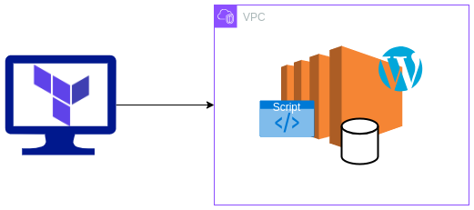

# Terraform examples

## aws_vm_wp  
This is just a simple example on how an application (in this case WordPress) could be installed into an AWS EC2 instance using terraform. It's just for test and definitely is not a production-ready example.
Just for simplicity, DB and Wordpress application are installed in the same server. Here a quick infrastructure schema.





* _main.tf_: contains the deployment of the VM
* _aws_security_group.tf_: define the security group access 
* _local_private_key.tf_: define a private key to upload to AWS to use to access to the server

### test terraform 
Firs of all, if you want to run this sample, you need to define in your environment AWS KEYs. It is not the best practice, but definitely the fastest to test it!   
Once you have it, you can start running 

```
# initialize 
terraform init

# just test everything
terraform validate
terraform plan

# to install it
terraform apply

# check the resources
terraform state

# delete everything
terraform destroy

```


